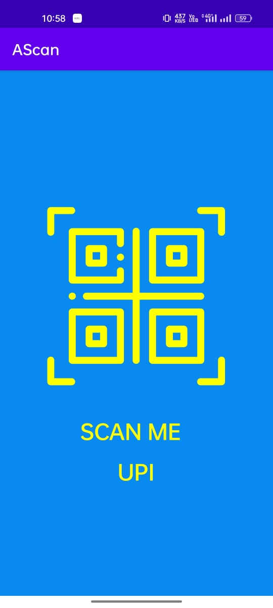
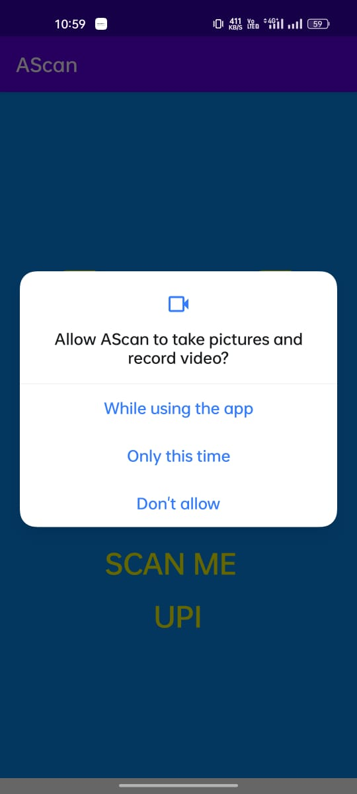
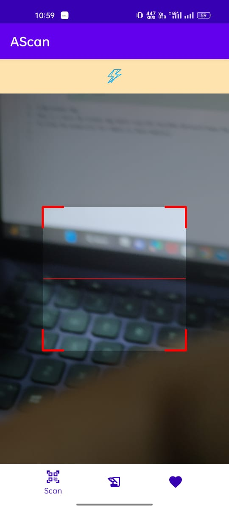
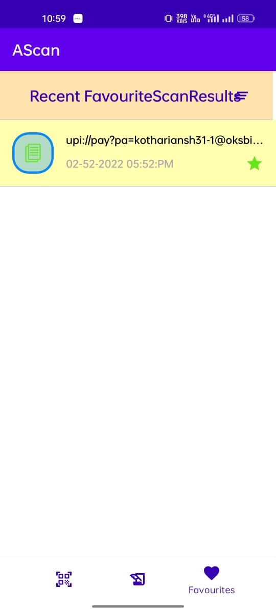

# QR-Scanner-App
This is a basic QR Scanner App which Scan UPI ID,other QR which have the personal information like in Aadhar card.It consist of three fragments.
## Splash Screen
This is the splash screen of the app.

## Tech Stacks

\
[Firebase Authentication](https://firebase.google.com/docs/auth/android/start)

I have  used the firebase for authentication in the apps .Users and admins can register for this app by email and set password for their accounts. Users and admin accounts have also
the feature of email verification .

[Firebase realtime database](https://firebase.google.com/docs/database)
\
[Firebase storage](https://firebase.google.com/docs/storage)

I have used realtime database and storage  of firebase for the store the books ,pdfs , magazines and control the views and downloads of the books ,pdfs .
 
At first, User have 
to allow the permission for camera in their mobile. 

 
Here,Home Screen contains the screen and the flash options for detect the QR Code 

 
Now,It has the also the options for Save the records of all the scans and also the options for remove it from database of our app.

 
we can share ,copy on clipboard  the scan results also and market it as favourite option also ,for differentiate them.

 
here,we have also the options for delete all the scan results.

 
There is another page for display all the favourite scan results to access  them easily.

 

